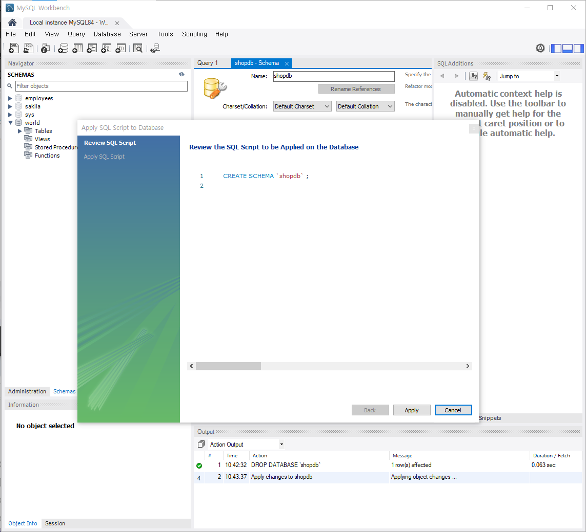
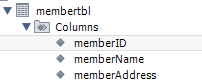
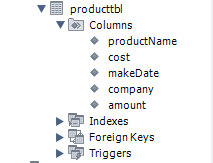
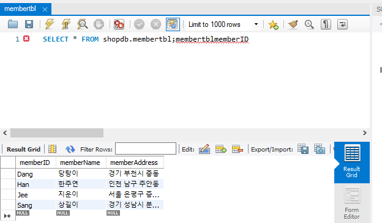
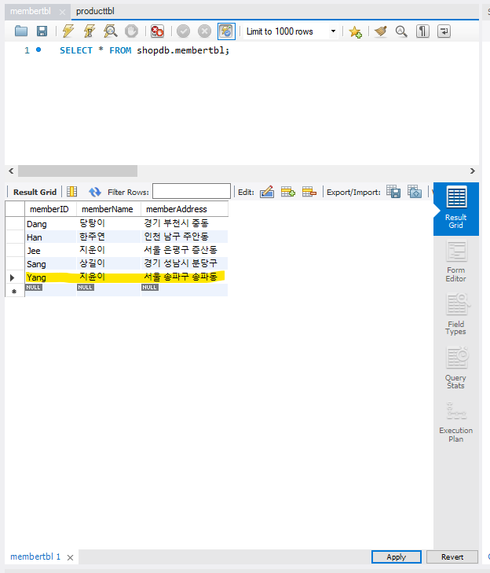
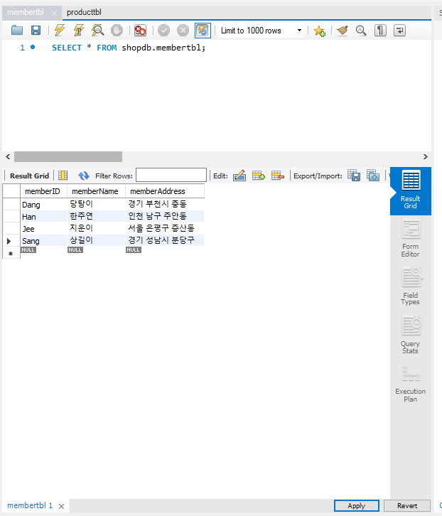

# MySQL 전체 운영 실습
**Q1.** 워크벤치의 GUI를 이용하여 shopdb 데이터베이스를 정의하세요. 작성 결과를 화면 캡처 하세요.



---
**Q2.** 워크벤치의 GUI를 이용하여 다음 테이블을 정의하세요. 작성 결과를 화면 캡처 하세요.

○ 회원 테이블(memberTBL) 정의



```sql
CREATE TABLE `shopdb`.`membertbl` (
  `memberID` CHAR(8) NOT NULL COMMENT '아이디',
  `memberName` CHAR(5) NOT NULL COMMENT '회원 이름',
  `memberAddress` CHAR(20) BINARY NULL COMMENT '주소',
  PRIMARY KEY (`memberID`),
  UNIQUE INDEX `memberID_UNIQUE` (`memberID` ASC) VISIBLE);
```

○ 제품 테이블(productTBL) 정의



```sql
CREATE TABLE `shopdb`.`producttbl` (
  `productName` CHAR(4) NOT NULL COMMENT '제품 이름',
  `cost` INT NOT NULL COMMENT '가격',
  `makeDate` DATE NULL COMMENT '제조일자',
  `company` CHAR(5) NULL COMMENT '제조회사',
  `amount` INT NOT NULL COMMENT '남은 수량',
  PRIMARY KEY (`productName`));
```

---
**Q3.** 워크벤치의 GUI를 이용하여 다음 테이블에 데이터를 추가하세요. 작성 결과를 화면 캡처 하세요.
○ memberTBL



```sql
INSERT INTO `shopdb`.`membertbl` (`memberID`, `memberName`, `memberAddress`) VALUES ('Dang', '당탕이', '경기 부천시 중동');
INSERT INTO `shopdb`.`membertbl` (`memberID`, `memberName`, `memberAddress`) VALUES ('Han', '한주연', '인천 남구 주안동');
INSERT INTO `shopdb`.`membertbl` (`memberID`, `memberName`, `memberAddress`) VALUES ('Jee', '지운이', '서울 은평구 증산동');
INSERT INTO `shopdb`.`membertbl` (`memberID`, `memberName`, `memberAddress`) VALUES ('Sang', '상길이', '경기 성남시 분당구');

```

○ productTBL

```sql
INSERT INTO `shopdb`.`producttbl` (`productName`, `cost`, `makeDate`, `company`, `amount`) VALUES ('컴퓨터', '10', '2021-01-01', '삼성', '17');
INSERT INTO `shopdb`.`producttbl` (`productName`, `cost`, `makeDate`, `company`, `amount`) VALUES ('세탁기', '20', '2022-09-01', 'LG', '3');
INSERT INTO `shopdb`.`producttbl` (`productName`, `cost`, `makeDate`, `company`, `amount`) VALUES ('냉장고', '5', '2023-02-01', '대우', '22');
```

---
**Q4.** 워크벤치의 GUI를 이용하여 memberTBL에 데이터를 하나 추가하세요. 작성 결과를 화면 캡처 하세요.



```sql
INSERT INTO `shopdb`.`membertbl` (`memberID`, `memberName`, `memberAddress`) VALUES ('Yang', '지윤이', '서울 송파구 송파동');
```

**Q5.** 앞에서 추가한 데이터를 삭제하세요. 작성 결과를 화면 캡처 하세요.



```sql
DELETE FROM `shopdb`.`membertbl` WHERE (`memberID` = 'Yang');
```

---
**Q6.** SQL 편집창을 띄워서 SQL 문으로 다음을 실행하세요.

○ productTBL 의 데이터를 출력하세요
○ memberTBL 의 데이터를 출력하세요. (단, memberName과 memberAddress만 출력함)
○ memberTBL 의 데이터 중 이름이 지운이 인 데이터만 출력하세요
○ 앞에서 작성한 3 개의 SQL 문을 한 번에 실행하세요

```sql
SELECT *
FROM shopdb.producttbl;

SELECT memberName, memberAddress
FROM shopdb.memberTBL;

SELECT *
FROM shopdb.memberTBL
WHERE memberName = '지운이';
```
