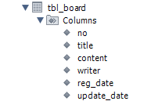
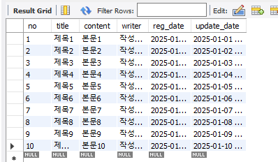

# MySQL 전체 운영 실습(심화 1)
**Q1.** 워크벤치의 GUI를 이용하여 다음 테이블을 정의하세요. 작성 결과를 화면 캡처 하세요.
○ 게시글 (tbl_board) 정의



```sql
CREATE TABLE `shopdb`.`tbl_board` (
  `no` INT NOT NULL COMMENT '게시글 ID',
  `title` VARCHAR(256) NOT NULL COMMENT '제목',
  `content` TEXT NULL COMMENT '본문',
  `writer` VARCHAR(50) NOT NULL COMMENT '작성자',
  `reg_date` DATETIME NULL COMMENT '등록일',
  `update_date` DATETIME NULL COMMENT '수정일',
  PRIMARY KEY (`no`));
```

---
**Q2.** 워크벤치의 GUI를 이용하여 tbl_board 테이블에 데이터를 10 건 추가하세요. 작성 결과를 화면 캡처 하세요.



```sql
INSERT INTO `shopdb`.`tbl_board` (`no`, `title`, `content`, `writer`, `reg_date`, `update_date`) VALUES ('1', '제목1', '본문1', '작성자1', '2025-01-01', '2025-01-01');
INSERT INTO `shopdb`.`tbl_board` (`no`, `title`, `content`, `writer`, `reg_date`, `update_date`) VALUES ('2', '제목2', '본문2', '작성자2', '2025-01-02', '2025-01-02');
INSERT INTO `shopdb`.`tbl_board` (`no`, `title`, `content`, `writer`, `reg_date`, `update_date`) VALUES ('3', '제목3', '본문3', '작성자3', '2025-01-03', '2025-01-03');
INSERT INTO `shopdb`.`tbl_board` (`no`, `title`, `content`, `writer`, `reg_date`, `update_date`) VALUES ('4', '제목4', '본문4', '작성자4', '2025-01-04', '2025-01-04');
INSERT INTO `shopdb`.`tbl_board` (`no`, `title`, `content`, `writer`, `reg_date`, `update_date`) VALUES ('5', '제목5', '본문5', '작성자5', '2025-01-05', '2025-01-05');
INSERT INTO `shopdb`.`tbl_board` (`no`, `title`, `content`, `writer`, `reg_date`, `update_date`) VALUES ('6', '제목6', '본문6', '작성자6', '2025-01-06', '2025-01-06');
INSERT INTO `shopdb`.`tbl_board` (`no`, `title`, `content`, `writer`, `reg_date`, `update_date`) VALUES ('7', '제목7', '본문7', '작성자7', '2025-01-07', '2025-01-07');
INSERT INTO `shopdb`.`tbl_board` (`no`, `title`, `content`, `writer`, `reg_date`, `update_date`) VALUES ('8', '제목8', '본문8', '작성자8', '2025-01-08', '2025-01-08');
INSERT INTO `shopdb`.`tbl_board` (`no`, `title`, `content`, `writer`, `reg_date`, `update_date`) VALUES ('9', '제목9', '본문9', '작성자9', '2025-01-09', '2025-01-09');
INSERT INTO `shopdb`.`tbl_board` (`no`, `title`, `content`, `writer`, `reg_date`, `update_date`) VALUES ('10', '제목10', '본문10', '작성자10', '2025-01-10', '2025-01-10');
```


---
**Q3.** SQL 편집창을 띄워서 SQL 문으로 다음을 실행하세요.
○ tbl_board 의 데이터를 모두 출력하세요
○ tbl_board 의 데이터를 출력하세요. (단, no, title, writer 만 출력함)
○ tbl_board 의 데이터 중 특정 작성자 한 명의 글만 출력하세요
○ 앞에서 작성한 3 개의 SQL 문을 한 번에 실행하세요

```sql
SELECT *
FROM shopdb.tbl_board;

SELECT no, title, writer
FROM shopdb.tbl_board;

SELECT content
FROM shopdb.tbl_board
WHERE no = '1';
```

---
# MySQL 전체 운영 실습(심화 2)
**Q4.** sakila 데이터베이스의 각 테이블을 조사하여 아래 표를 완성하세요

○ actor
|컬럼명|데이터타입|PK|NN|기본값|설명|
|------|-----------|--|--|------|----|
|actor_id   |smalint    |O |O |  |  |
|first_name |varchar(45)|  |  |  |  |
|last_name  |varchar(45)|  |  |  |  |
|last_update|timestamp  |  |  |  |  |

○ address
|컬럼명|데이터타입|PK|NN|기본값|설명|
|------|-----------|--|--|------|----|
|address_id |smallint   |O |O |  |  |
|address    |varchar(50)|  |  |  |  | 
|address2   |varchar(50)|  |  |  |  | 
|district   |varchar(20)|  |  |  |  |
|city_id    |smallint   |  |O |  |  |
|postal_code|varchar(10)|  |  |  |  |
|phone      |varchar(20)|  |  |  |  |
|location   |geometry   |  |  |  |  |
|last_update|timestamp  |  |  |  |  |

○ category
|컬럼명|데이터타입|PK|NN|기본값|설명|
|------|-----------|--|--|------|----|
|category_id|tinyint    |O |O |  |  |
|name       |varchar(25)|  |  |  |  |
|last_update|timestamp  |  |  |  |  |

○ city
|컬럼명|데이터타입|PK|NN|기본값|설명|
|------|-----------|--|--|------|----|
|city_id    |smallint   |O |O |  |  |
|city       |varchar(50)|  |  |  |  |
|country_id |smallint   |  |O |  |  |
|last_update|timestamp  |  |  |  |  |

○ country
|컬럼명|데이터타입|PK|NN|기본값|설명|
|------|-----------|--|--|------|----|
|country_id |smallint   |O |O |  |  |
|country    |varchar(50)|  |  |  |  |
|last_update|timestamp  |  |  |  |  |

○ customer
|컬럼명|데이터타입|PK|NN|기본값|설명|
|------|-----------|--|--|------|----|
|customer_id|smallint   |O |O |  |  |
|store_id   |tinyint    |  |O |  |  |
|first_name |varchar(45)|  |  |  |  |
|last_name  |varchar(45)|  |  |  |  | 
|email      |varchar(50)|  |  |  |  | 
|address_id |smallint   |  |O |  |  |
|active     |tinyint(1) |  |  |  |  | 
|create_date|datetime   |  |  |  |  | 
|last_update|timestamp  |  |  |  |  |

○ film
|컬럼명|데이터타입|PK|NN|기본값|설명|
|------|-----------|--|--|------|----|
|film_id             |smallint    |O |O |  |  |
|title               |varchar(128)|  |  |  |  |
|description         |text        |  |  |  |  |
|release_year        |year        |  |  |  |  |
|language_id         |tinyint     |  |O |  |  |
|original_language_id|tinyint     |  |O |  |  |
|rental_duration     |tinyint     |  |O |  |  |
|rental_rate         |decimal(4,2)|  |  |  |  |
|length              |smallint    |  |O |  |  |
|replacement_cost    |decimal(5,2)|  |  |  |  |
|rating              |enum('G','PG','PG-13','R','NC-17')|  |  |  |  |
|special_features    |set('Trailers','Commentaries','Deleted Scenes','Behind the Scenes')|  |  |  |  |
|last_update         |timestamp   |  |  |  |  |

○ film_actor
|컬럼명|데이터타입|PK|NN|기본값|설명|
|------|-----------|--|--|------|----|
|actor_id   |smallint |O |O |  |  |
|film_id    |smallint |O |O |  |  |
|last_update|timestamp|  |  |  |  |

○ film_category
|컬럼명|데이터타입|PK|NN|기본값|설명|
|------|-----------|--|--|------|----|
|film_id    |smallint |O |O |  |  |
|category_id|tinyint  |O |O |  |  |
|last_update|timestamp|  |  |  |  |

○ film_text
|컬럼명|데이터타입|PK|NN|기본값|설명|
|------|-----------|--|--|------|----|
|film_id    |smallint    |O |  |  |  |
|title      |varchar(255)|  |  |  |  |
|description|text        |  |  |  |  |

○ inventory
|컬럼명|데이터타입|PK|NN|기본값|설명|
|------|-----------|--|--|------|----|
|inventory_id|mediumint|O |O |  |  |
|film_id     |smallint |  |O |  |  |
|store_id    |tinyint  |  |O |  |  |
|last_update |timestamp|  |  |  |  |

○ language
|컬럼명|데이터타입|PK|NN|기본값|설명|
|------|-----------|--|--|------|----|
|language_id|tinyint  |O |O |  |  |
|name       |char(20) |  |  |  |  |
|last_update|timestamp|  |  |  |  |

○ payment
|컬럼명|데이터타입|PK|NN|기본값|설명|
|------|-----------|--|--|------|----|
|payment_id  |smallint    |O |O |  |  |
|customer_id |smallint    |  |O |  |  |
|staff_id    |tinyint     |  |O |  |  |
|rental_id   |int         |  |  |  |  |
|amount      |decimal(5,2)|  |  |  |  |
|payment_date|datetime    |  |  |  |  | 
|last_update |timestamp   |  |  |  |  | 

○ rental
|컬럼명|데이터타입|PK|NN|기본값|설명|
|------|-----------|--|--|------|----|
|rental_id   |int      |O |O |  |  |
|rental_date |datetime |  |  |  |  |
|inventory_id|mediumint|  |O |  |  |
|customer_id |smallint |  |O |  |  |
|return_date |datetime |  |  |  |  |
|staff_id    |tinyint  |  |O |  |  |
|last_update |timestamp|  |  |  |  |

○ staff
|컬럼명|데이터타입|PK|NN|기본값|설명|
|------|-----------|--|--|------|----|
|staff_id   |tinyint    |O |O |  |  |
|first_name |varchar(45)|  |  |  |  | 
|last_name  |varchar(45)|  |  |  |  | 
|address_id |smallint   |  |O |  |  |
|picture    |blob       |  |  |  |  | 
|email      |varchar(50)|  |  |  |  | 
|store_id   |tinyint    |  |O |  |  |
|active     |tinyint(1) |  |  |  |  |
|username   |varchar(16)|  |  |  |  | 
|password   |varchar(40)|  |  |  |  | 
|last_update|timestamp  |  |  |  |  |

○ store
|컬럼명|데이터타입|PK|NN|기본값|설명|
|------|-----------|--|--|------|----|
|store_id        |tinyint  |O |O |  |  |
|manager_staff_id|tinyint  |  |O |  |  |
|address_id      |smallint |  |O |  |  |
|last_update     |timestamp|  |  |  |  |
